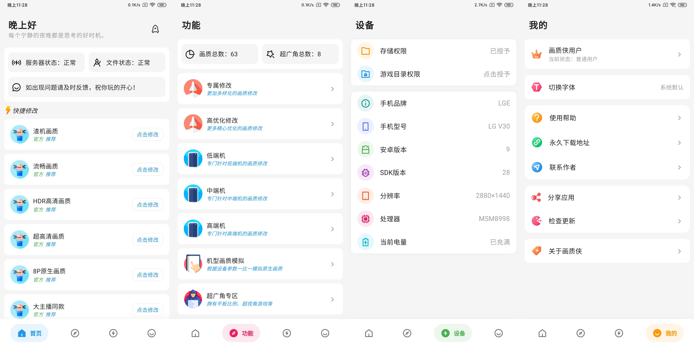

# 画质侠

一款和平精英画质助手，是之前开发的 [Doge画质助手](https://github.com/shinexoh/dogehzzs) 升级版。仅支持安卓手机，没什么技术含量 :)

## 应用功能

* 一些简单的画质修改
* 通过购买卡密激活即可使用
* 还有一些花里胡哨没用的功能
* 支持安卓13画质修改

## 应用截图

## 其他

这个分支使用了 [Provider](https://pub.dev/packages/provider) 对状态管理的代码进行了重构，因为没什么复杂的状态需要管理，需要写的代码也很少。

路由管理使用了默认的Navigator，因为没有什么复杂的路由需要管理，跟GetX Say goodbye :)
